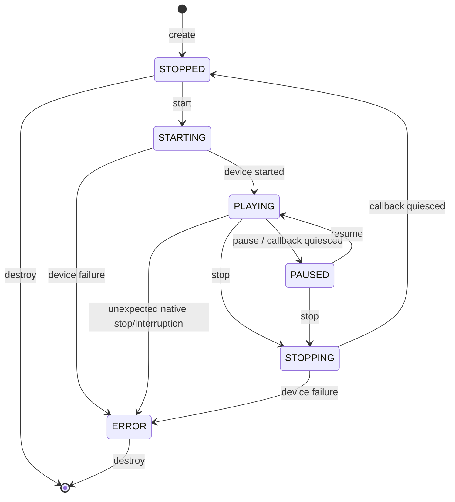

# Media playback ownership

## Decision

SaltsUtils owns native media-device I/O. `Salts::Playback` is the sole audio
output provider and accepts already-decoded PCM. TurboMedia owns demuxing,
decoding, clocking, file semantics, and playlists; it does not own an audio
device backend.

The first migration deliberately targets the production data plane used by
TurboMedia's FFmpeg player. The old `turbo_playback_create_file()` and queue
helpers are not copied into SaltsUtils because they combine media-layer policy
with device I/O and have no production caller outside their own tests.

## Alternatives

| Alternative | Result |
| --- | --- |
| Keep playback in TurboMedia | Rejected: capture and playback would retain different owners and platform matrices. |
| Move the complete legacy object | Rejected: it moves file decoding, playlists, a hand-written ring, and unsafe callback state into the device layer. |
| Add a bounded PCM sink to SaltsUtils | Selected: one device owner, one explicit data plane, and a small cross-platform contract. |

## Ownership and threading

- One control owner calls create, lifecycle, volume, clear, drain, and destroy.
- Exactly one producer calls `salts_playback_write()`.
- The native audio callback is the sole consumer of the Salts SPSC byte ring.
- Input passed to `write` is borrowed and copied before the function returns.
- A short successful write is explicit backpressure; no data is dropped or
  overwritten.
- State callbacks run synchronously on the control-owner thread, are
  notifications only, and do not call mutating playback APIs. The real-time
  audio callback never invokes application code.
- `destroy` stops and joins the device callback before freeing the ring and
  object. `clear` resets the same ring; neither operation may race the producer.

Retained PCM is hard-limited to exactly the frame-aligned
`buffer_duration_ms` capacity. The underlying SPSC allocation rounds that
capacity plus its sentinel to a power of two and is always less than twice that
size plus two bytes. Configuration is validated before opening a device;
malformed configurations fail without a fallback backend.

## State machine

| State | Event | Result | Next state |
| --- | --- | --- | --- |
| STOPPED | start | Start native device | PLAYING or ERROR |
| PLAYING | start | Idempotent success | PLAYING |
| PLAYING | pause | Stop native callback, retain PCM | PAUSED or ERROR |
| PAUSED | resume | Restart native callback | PLAYING or ERROR |
| PLAYING/PAUSED | stop | Stop callback, retain PCM | STOPPED or ERROR |
| STOPPED | stop | Idempotent success | STOPPED |
| Any non-terminal | illegal lifecycle event | `SALTS_PLAYBACK_ERR_BUSY` | unchanged |

`clear` is a control-plane operation. If playback is active it temporarily
quiesces the native callback, resets the ring, then restores the active device;
failure moves the object to `ERROR`. `drain` never changes state: it waits only
while the device can consume data and returns a bounded timeout error.

## Platform and packaging

`Salts::Playback` is exported on Windows, Linux, macOS, Android, and iOS.
miniaudio is a private backend detail. Package consumers link only
`Salts::Playback`; backend include paths and target names do not enter the
installed interface.

## Migration and rollback

1. Publish `Salts::Playback` with unit, lifecycle, and installed-package tests.
2. Change TurboMedia's player to consume `salts_playback.h` and
   `Salts::Playback`.
3. Remove TurboMedia's playback implementation and direct miniaudio dependency.
4. Separate TurboMedia client/server build profiles after device ownership is
   no longer local.

Before step 3, rollback is a TurboMedia dependency switch. After step 3,
rollback requires reverting the removal commit and is verified by the same
player and package-consumer tests.
